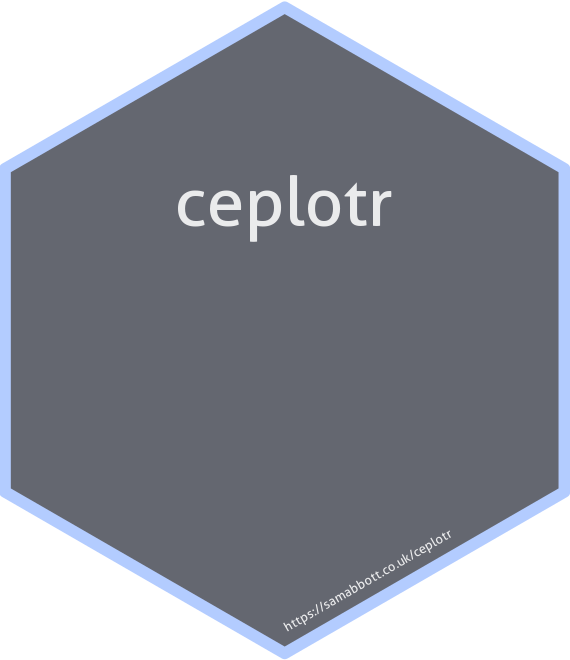

```{r, echo = FALSE}
knitr::opts_chunk$set(
  collapse = TRUE,
  comment = "#>",
  fig.path = "man/figures/"
)
```

# `{SpeedyMarkov}`: Speed up Discrete Markov Model Cost Effectiveness Simulations 

[](https://mybinder.org/v2/gh/seabbs/SpeedyMarkov/master?urlpath=rstudio) 
[](https://CRAN.R-project.org/package=SpeedyMarkov)
[](https://github.com/seabbs/SpeedyMarkov)
[](https://zenodo.org/badge/latestdoi/219757940)

**Work in progress**

The work in this package was started at the Health Economic 2019 hackathon hosted at Imperial. Much of this work is based on that develped by the [hermes6](https://github.com/HealthEconomicsHackathon/hermes6) team. The original reference approach was developed by [Howard Thom](https://orcid.org/0000-0001-8576-5552). 


This package aims to: 

* Compare a functional markov modelling approach to a reference approach for several example models.
* Explore approaches to speeding up Markov modelling in a principled fashion.
* Inspire more efficient markov modelling code. 
* Provide a toolkit for use in discrete Markov modelling.

For help getting started see the [Getting Started](https://www.samabbott.co.uk/SpeedyMarkov/articles/intro.html) vignette.

## Installation

Install the CRAN version (when released):

```{r cran-installation, eval = FALSE}
install.packages("SpeedyMarkov")
```

Alternatively install the development version from GitHub:

```{r gh-installation, eval = FALSE}
# install.packages("remotes")
remotes::install_github("seabbs/SpeedyMarkov")
```

## Documentation

[](https://www.samabbott.co.uk/SpeedyMarkov/)
[](https://www.samabbott.co.uk/SpeedyMarkov/dev)
[](https://www.samabbott.co.uk/SpeedyMarkov/articles/intro.html)
[](https://www.samabbott.co.uk/SpeedyMarkov/reference/index.html)


## Testing

[](https://travis-ci.org/seabbs/SpeedyMarkov)
[](https://ci.appveyor.com/project/seabbs/SpeedyMarkov)
[](https://codecov.io/github/seabbs/SpeedyMarkov?branch=master)

## Quick start

The first step is to specify a Markov model in the format specificed by `SpeedyMarkov`. An example framework is `example_two_state_markov` which is a two state Markov model that compares an intervention to a baseline. See `?example_two_state_markov` for more details.

```{r}
SpeedyMarkov::example_two_state_markov()
```

Once a model has been specified a cost effectiveness analysis can run using the following function call.

```{r}
SpeedyMarkov::markov_ce_pipeline(SpeedyMarkov::example_two_state_markov(), 
                                 duration = 100, samples = 10, discount = 1.035, 
                                 baseline = 1, willingness_to_pay_thresold = 20000)
```


See [Functions](https://www.samabbott.co.uk/SpeedyMarkov/reference/index.html) for more details of the functions included in the package (`markov_ce_pipeline` for example wraps multiple modular - user customisable - functions).

## Contributing

File an issue [here](https://github.com/seabbs/SpeedyMarkov/issues) if there is a feature that you think is missing from the package, or better yet submit a pull request.

Please note that the `SpeedyMarkov` project is released with a [Contributor Code of Conduct](https://github.com/seabbs/SpeedyMarkov/blob/master/.github/CODE_OF_CONDUCT.md). By contributing to this project, you agree to abide by its terms.

## Citing 

If using `SpeedyMarkov` please consider citing the package in the relevant work. Citation information can be generated in R using the following (after installing the package),

```{r}
citation("SpeedyMarkov")
```

## Docker

This package has been developed in docker based on the `rocker/tidyverse` image, to access the  development environment enter the following at the command line (with an active docker daemon running),

```{bash, eval = FALSE}
docker pull seabbs/SpeedyMarkov
docker run -d -p 8787:8787 -e USER=SpeedyMarkov -e PASSWORD=SpeedyMarkov --name SpeedyMarkov seabbs/speedymarkov
```

The rstudio client can be accessed on port `8787` at `localhost` (or your machines ip). The default username is ceplotr and the default password is SpeedyMarkov. Alternatively, access the development environment via [binder](https://mybinder.org/v2/gh/seabbs/SpeedyMarkov/master?urlpath=rstudio).

